# BWSort v1.0
## What
A GUI application to sort, rename, filter and backup replays from the popular RTS-game Starcraft Brood War. 

## Features
+ Parse replays by importing replay files from multiple directories. View the parsed replays in the replay list view.
  + You can create ignore files and use them to ignore replays while parsing.
+ Categorize or "sort" replays into a new directory by choosing from the following list of criteria: player name, match-up, map, duration and game type. 
  + You can preview sort output
+ Rename replays according to a special syntax allowing you to extract information such as player names, match-up, race, duration, date,... You can rename replays as is, or also move them into a new output directory.
+ Filter parsed replays on player-name, winner, race, match-up, duration, date or map. Will support units and build orders in the near future as well!
+ Backup entire directories of replays and have the possibility to always recover them exactly as they were! You can easily share database files with each other manually. In the future there might be built-in way.

## How to install
Currently there are 3 ways to get the program:
1. Use the setup.exe installer from .RAR archive
2. Use the non-setup based .exe from the .RAR archive labelled as such
3. Compile from source

You can find the latest release here: <https://github.com/CrispyDrone/BWSort/releases/tag/v1.0>

## User guide
After an optional installation, run the .exe file.

### Parse replays
First things first, you will have to parse replays. Choose a directory by clicking the set directory button, and next click on the Add button:

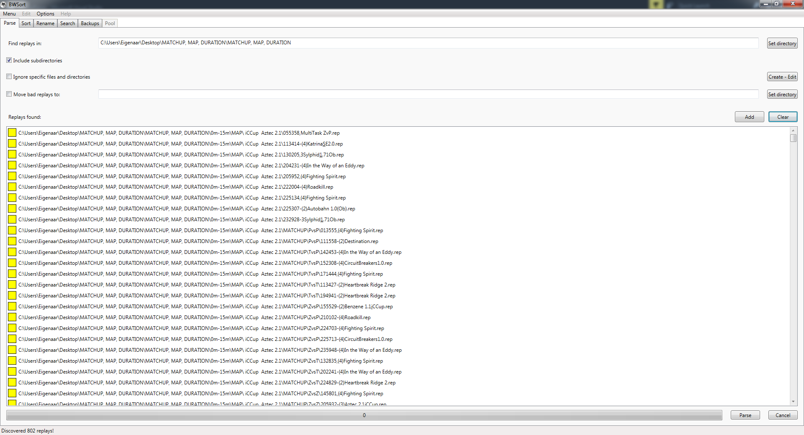

You can repeatedly import replays from directories and they will show up in the listbox at the bottom of the screen with a yellow box in front of them. This means these replays are waiting to be parsed. Next, click on parse and wait til all replays have been parsed.  Once it's finished, if the replay has been parsed successfully it will show a green box in front of it, otherwise a red box. 

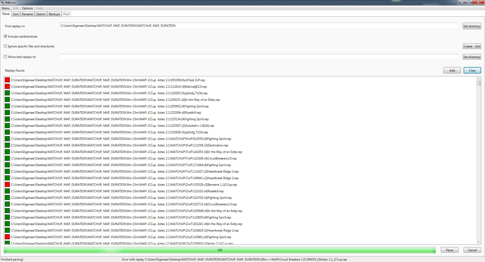

If there are certain replays that you never want to parse, you can make use of an ignore file. Click on the `Create - Edit` button at the right side of the window. This will open a new buffer for you to create an ignore file in, or it will edit the ignore file that's configured in the [advanced settings](#advanced-settings). 

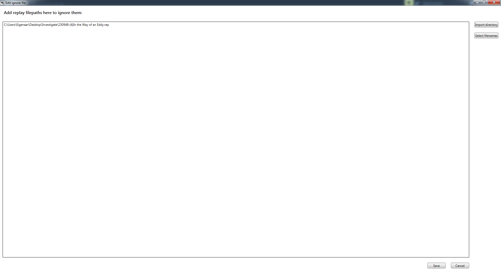

You can click on the `Import directory` to import all the filenames (recursively) in that directory. You can click on the `Select filenames` to select multiple replays you would like to ignore. __Note__ that you specify filenames, however the ignore functionality works based on file hashes. This means that it will ignore these replays you've specified, regardless of what the actual file name is!

### View and filter replays
After you've parsed replays, you can see your results in the Search tab:

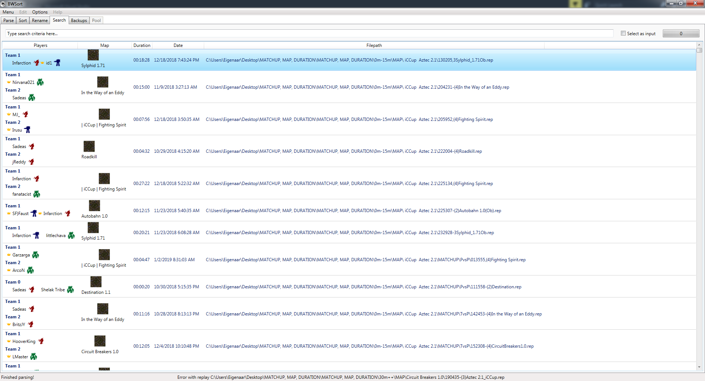

A crown indicates the winning players. You can see the different teams that were part of the game. [Team extraction is currently buggy due to known issues with the replay parsing.](#known-issues). Each player's race is visible and there are some additional columns showing the map, duration, the date the game was played and the path of the replay file.

You can filter this list of replays by typing filter expression in the search bar. Aside from using this search function to find a specific replay, you can also use it as input for the sorting and renaming actions but more on that later.

#### Filter syntax
To use a filter you specify its code followed by a colon. You combine individual filters by separating them with a comma.

Filter 		| code
---------------	| ----
Map		| m
Player		| p
Duration	| du
Match-up	| mu
Date		| d

For each of the following filters you can combine different conditions by using the vertical bar `|`:
+ Filter on map by using the `m:<mapname>` filter.

  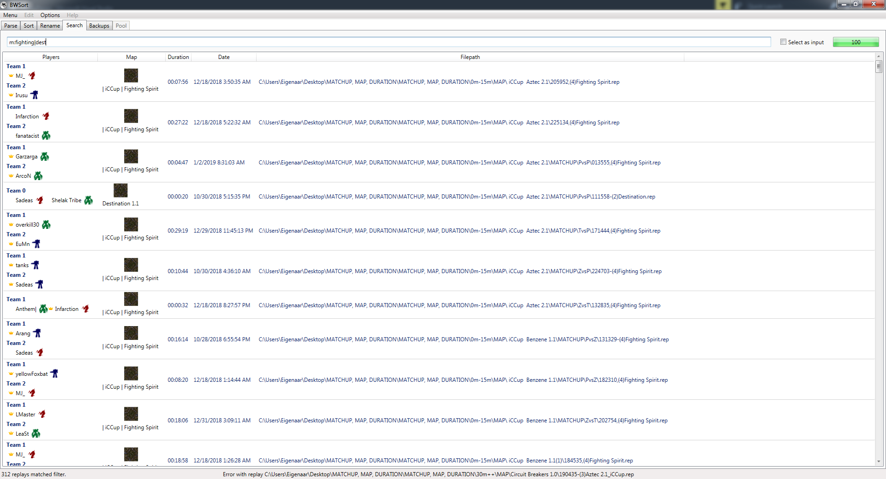

  You can specify any part of the map name and it will find it. The `<mapname>` can also be a regular expression allowing for more advanced usage.

+ Filter on player by using the `p:<playername>` filter. This filter allows you to optionally specify whether this player needs to be a winner `& isWinner`, and which race they need to be `& race=<race>`.

  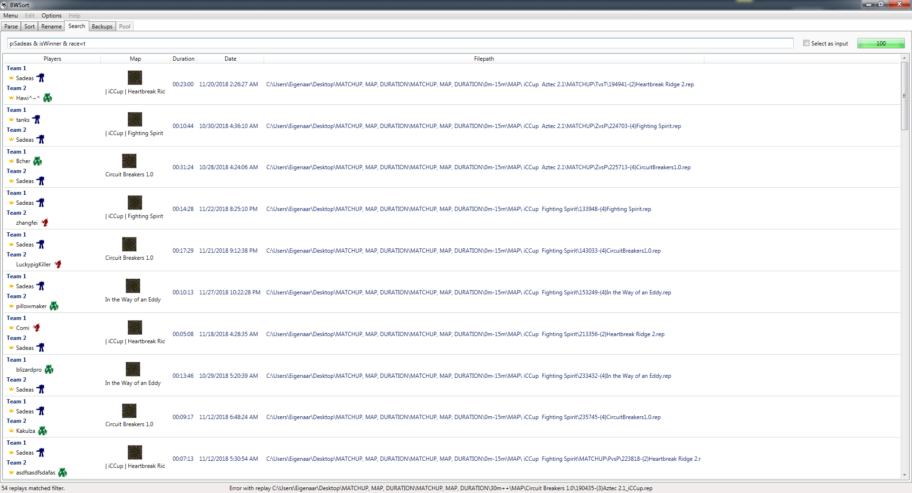

  You can search for any part of a player name. You can also add the `& isWinner` construct to filter out replays where this player lost, [unfortunately as mentioned before due to strange results for teams when parsing the replays this doesn't work as well as I would hope.](#known-issues). You can also further restrict the set of replays to only show those where this player is of a specific race by using the `& race=<race>` construct. You can specify `z`, `t`, or `p`.

+ Filter on duration by using the `du:<duration>` filter. This filter allows you to search for replays lesser than, greater than or equal a specific duration. You can also search for replays between 2 durations.

  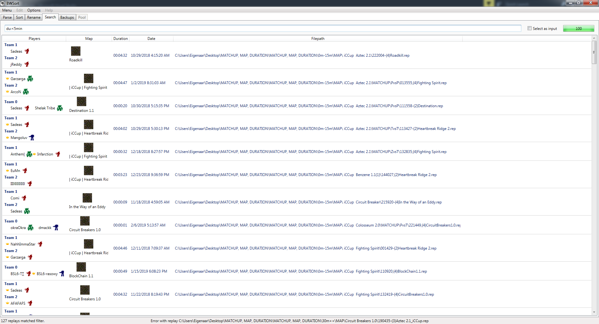

  You can use specify digital or written durations and use the following operators `<`, `<=`, `>`, `>=`, `=` to specify ranges or an exact match. For the digital pattern you can specify minutes and seconds, so for example: `5:00` would mean 5 minutes. You can also specify hours like so `01:03:15` which would mean 1 hour, 3 minutes and 15 seconds. The written durations are of the following format `x<hours>y<minutes>z<seconds>` where any element can be optional: 
  + `<hours>`: can be either `h`, `hrs`, or `hours`
  + `<minutes>`: can be either `m`, `min`, or `minutes`
  + `<seconds>`: can be either `s`, `sec`, or `seconds`

  It is also possible to search for replays between 2 durations, use the `between x-y` construct for this. `x` and `y` can be any format previously discussed.

  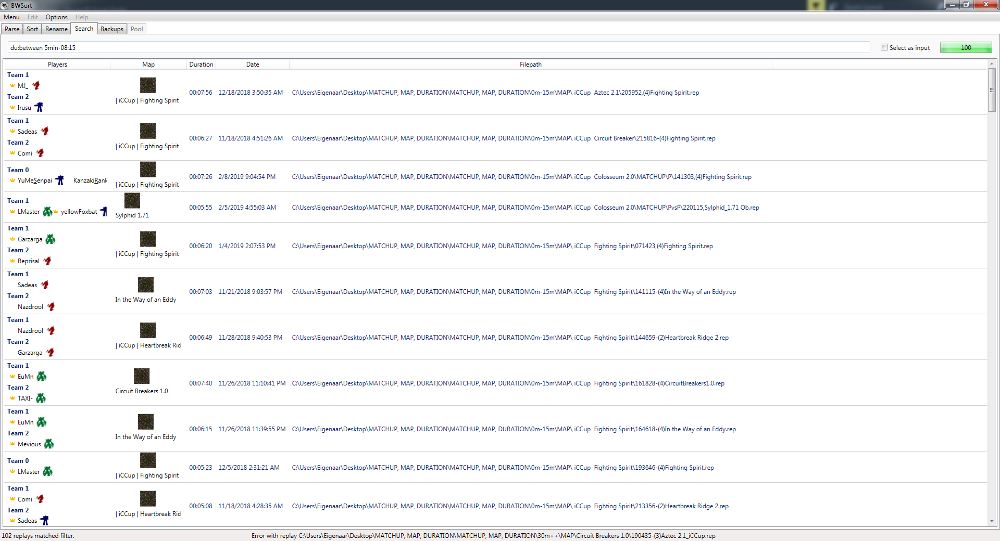

+ Filter on match-up by using the `mu:<matchup>` filter. This filter allows you to search for replays matching the desired match-up.

  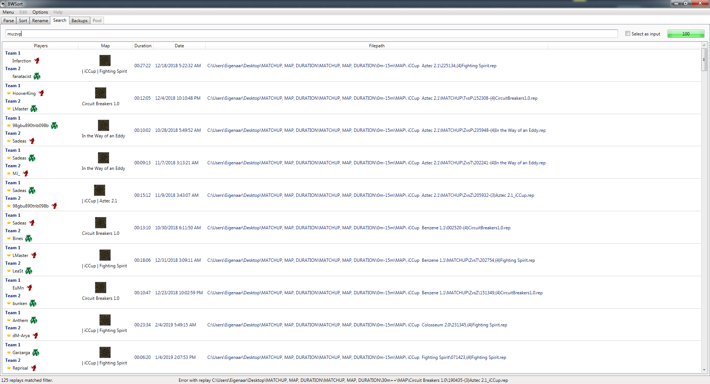

  You can specify a match-up of the format `xvx` where x can be either `z`, `t`, `p`, or `.`. The latter is a wildcard meaning it can be any race. Currently it's not possible to search for "broken" match-ups where there's only a single team.

+ Filter on date by using the `d:<date>` filter. You can use absolute and relative dates.

  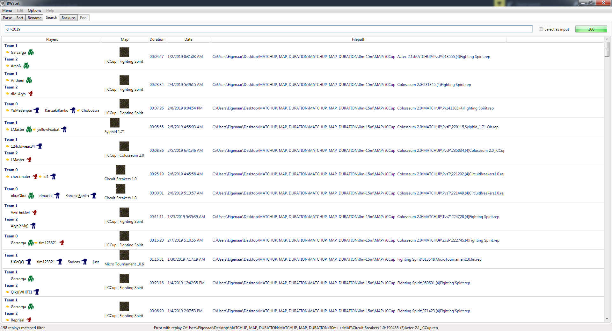

  You can specify relative or absolute dates to filter replays. Same as for durations the operators `<`, `<=`, `>`, `>=`, `=` are available. Note the dates represent a specific point in time. This means that when you say `<4 months and 3 weeks ago` it does not mean "less than 4 months and 3 weeks ago" but instead it means __before__ 4 months and 3 weeks ago! The digital pattern is as follows `<year><sep><month><sep><day>`:
  + `<year>`: Mandatory, can be 2 or 4 digits. 
  + `<month>`: Optional, can be 1 or 2 digits. 
  + `<day>`: Optional, can be 1 or 2 digits.
  + `<sep>`: Separator, can be `-`, `.` or `/`.

  The relative dates support many more options:
  + You can specify `this` or `last` together with `year`, `month` or `week`.
  + You can specify `today` or `yesterday`
  + You can specify any month of the year literally such as `january`.
  + You can use a date of the format `<number><time-unit> ago` for example such as `5 months ago`, or `<number><time-unit> and ... ago` for example `5 months and 3 weeks ago`
    + 1 week is counted as 7 days
    + 1 month is counted as 31 days
    + 1 year is counted as 365 days
  + Finally there is also the `previous <number><time-unit>`. This allows you to more easily refer to a time range of a specific time unit. For example `previous 2 weeks` would span the period between the ending of last week and the beginning of 2 weeks ago.

  Finally, same as for the duration filter, you can use the `between x and y` construct to filter replays between 2 dates. `x` and `y` can be any format previously described. Note that `between` works __inclusively__ which means that it acts as if you stated `>= date1 and <= date2`.

#### Some additional examples
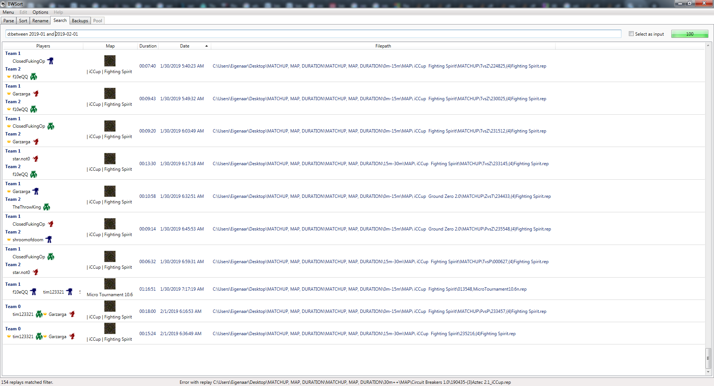
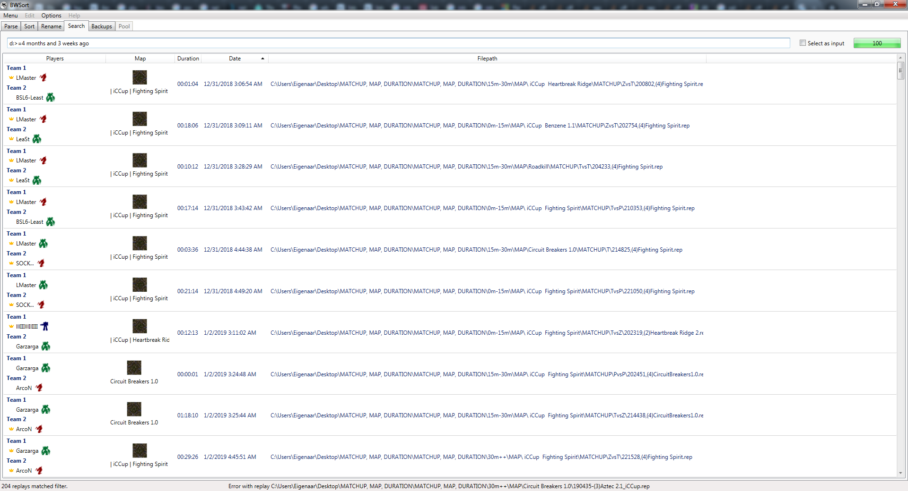
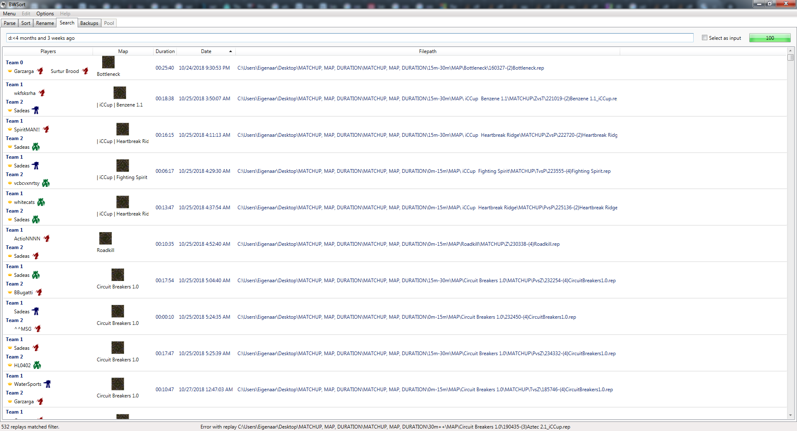
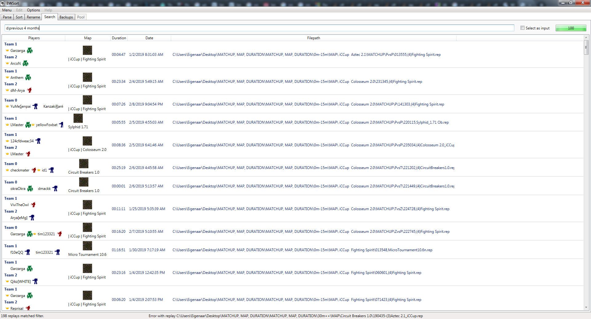

### Sorting replays
After parsing, you have the option to sort or categorize your replays to an output directory of your choice. You can either decide to sort the entire set of replays you've parsed, or to first filter them appropriately and then selecting the `Select as input` checkbox.

On the sort tab you specify the output directory, and can drag the blocks that represent the sort criteria into the order you want. To activate a sort criteria, click on it, it should turn blue. After you've decided on the sort criteria you want to use, you can tick off the `preview` checkbox and press the sort button below. This will render a preview inside the view. In case you also want to rename your replays while sorting, uncheck the `Keep original replay names` checkbox and you will be able to specify a renaming format. For the syntax, check the [renaming syntax section.](#renaming-syntax)

The following criteria are currently supported:

1. Playername: You can specify whether to make folders for winner-only, loser-only, both or none (this latter essentially allows you to extract/copy all replays from a directory tree, and rename them according to a custom format).
2. Map
3. Duration: You can specify your own intervals. `5 10 30` will result in the intervals 0-5min, 5-10min, 10-30min, and 30+min.
4. Matchup: You can specify which game types you want to include since it might not be so useful to know the "match-up" for a UMS-game.
5. Gametype

Finally it is possible to combine multiple sort criteria. For example `map playername` will sort your replays first on the map the game was played on, and then create additional folders per player name within the map folder.

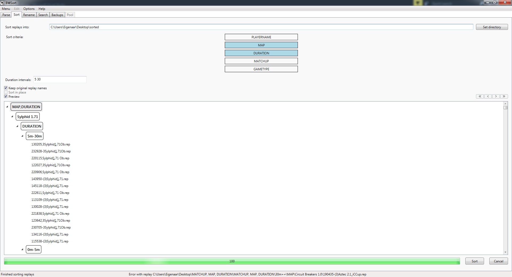

### Renaming replays
You can now rename replays after parsing, either into an output directory or in place. After renaming, the transformation from the old to new filename will be shown in the output view. There are 2 arrows visible on top of this part of the window. You can use these to undo or redo renames. The number of actions you can undo or redo can be configured in the advanced settings but by default is 5. If you are executing renames on many replays, be aware that this has the potential to quickly increase memory usage. 

It is also possible at any point to always return to how the replays were named originally. Just tick off the checkbox `Restore original replay names` and execute the rename.

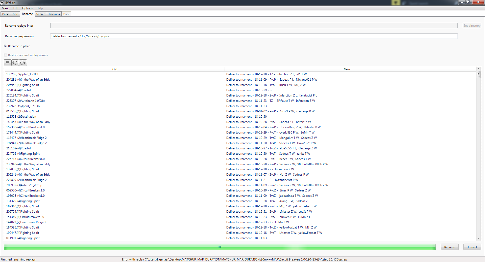

#### Renaming syntax
The current syntax is quite sensitive, so be careful to not include any unnecessary spaces anywhere. The syntax consists of:
1. T[separator] with separator being a single character (for example `,` or `_` ). This will extract the teams from the replay and separate individual players per team using the separator.
2. WT[separator] only extracts the winning team.
3. LT[separator] only extracts the losing team.
4. MU gets the match-up.
5. M gets the map.
6. DU gets the game length.
7. D gets the date the game was played on.
8. WR extracts the winning race.
9. LR extracts the losing race.

You have to use vertical bars `|` to separate arguments. 

#### Examples
1. `DU|M|WT[_]`: will give a replay of the format: `15min13sFightingSpirit(CrispyDrone_Jaedong).rep`
2. `D|MU|M|DU`: will give a replay of the format: `11-03-19ZZvsTTFightingSpirit15min13s.rep`

### Backup replays
You can backup directories containing replays. First you will have to create a new database file; you can give it a name and create it in a specific directory, it will be automatically selected as the active database.

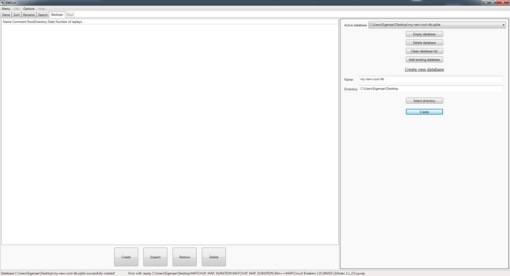

To create a backup, press the create button at the bottom of the screen. A new window will pop up:

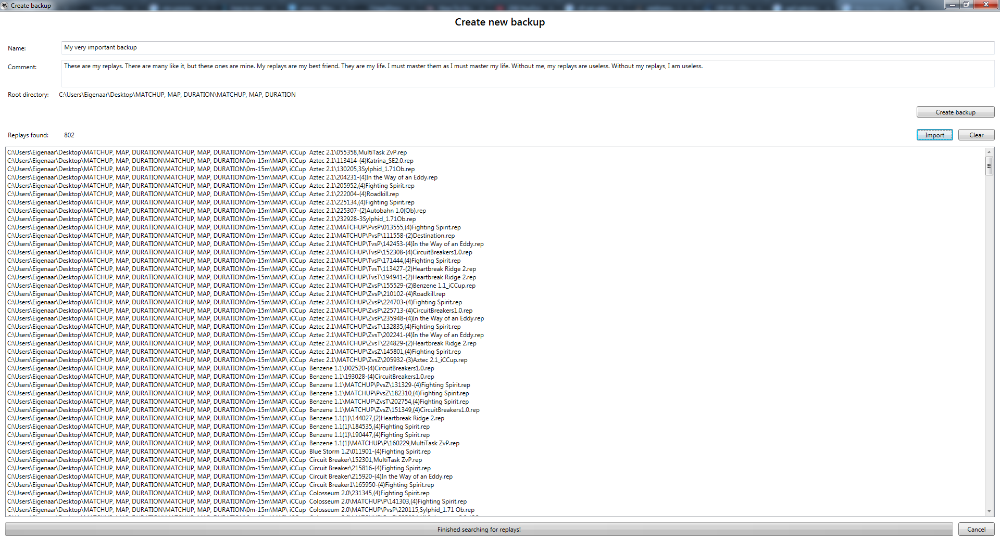

You can specify a name and an optional comment. To add replays to this backup click on the import button. At the moment, you can only import replays from one directory! This is because when restoring from a backup, it needs to be able to write to a single directory. [Maybe in the future, there will be support to make it so you can import replays from multiple directories, and it will congregate the multiple directories under one parent directory when executing the restore.](#towards-the-future) To now create a backup, click on the `Create backup` button.

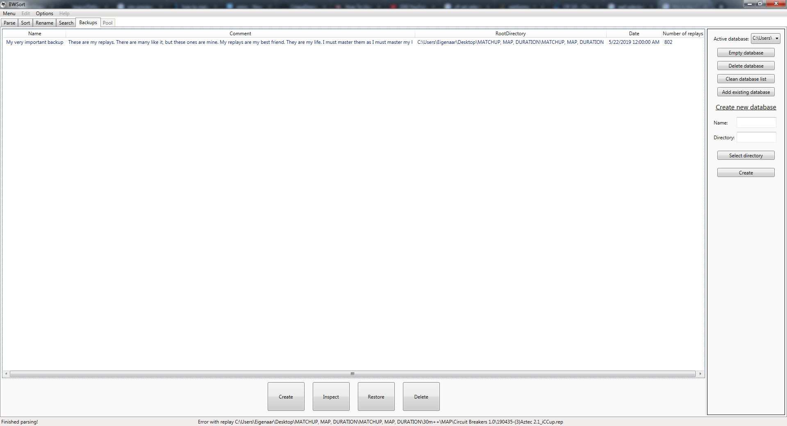

After you've created a backup, you can inspect it. You'll be able to see its name, the comment, how many replays, which directory you backed up, on which date, and finally the directory and file hierarchy of the folder you backed up.

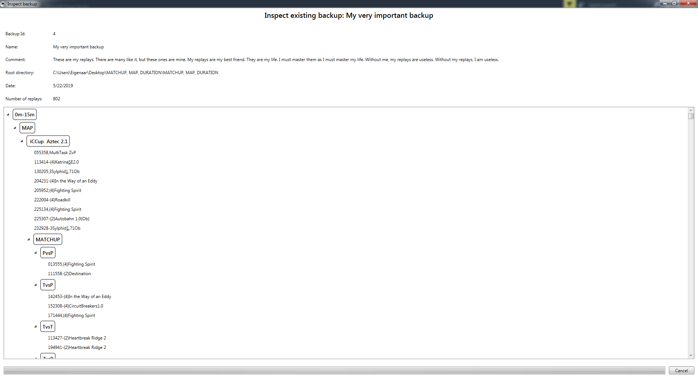

Once you remember what this backup was all about, and you need to restore replays from it, you can press the restore button. Just select a directory and click on the restore button!

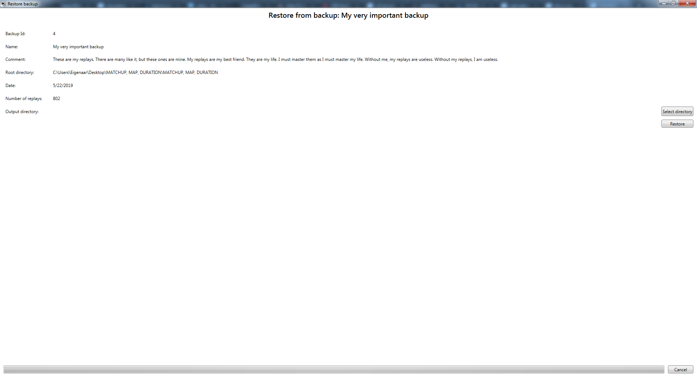

You can delete a backup in case you don't need it any more. Select the `Delete orphan replays` in case you want to also delete all replays that are not part of any backup.

Finally, there are some extra buttons in the panel on the side:
+ Empty database: If for some reason you want to delete all the data in the database, you can click on this button.
+ Delete database: This will delete the database file, and from the list.
+ Clean database list: This will verify whether the databases still exist and if not, delete them from the list.
+ Add existing database: If you have an existing database that's not part of the list (someone shared it with you for example, or you moved the database to another location), use this button.

### Advanced settings

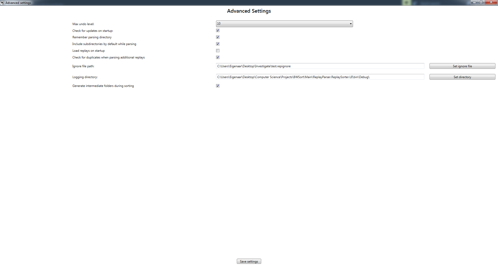

+ Max undo level: This setting controls the maximum number of undos or redos you can do.
+ Check for updates on startup: Check to check at startup whether a newer version is available.
+ Remember parsing directory: Check to remember the last-used parsing directory.
+ Include subdirectories by default while parsing: Check to always include subdirectories when discovering replays.
+ Load replays on startup: Check to start parsing replays automatically from the last-used parsing directory. This option requires Remember parsing directory to be checked.
+ Check for duplicates when parsing additional replays: When checked, will ensure no duplicate replays are parsed.
+ Ignore file path: The location of the ignore file you want to use. You still need to check the `Ignore specific files and directories` checkbox when parsing for it to have an effect. 
+ Logging directory: The directory to to write logging information to. This can be helpful to solve bugs and strange behavior.
+ Generate intermediate folders during sorting: When using multiple sort criteria, by default it will generate intermediare folders named after the criteria, if you don't like these folders, uncheck this option.

## Remarks
1. For now only replays of version 1.18 or later are supported. I was looking into a way to decompress the PKWARE compressed replay files, but the algorithm used in other parsers didn't make much sense to me. If anyone wants to help me implement this, feel free to contact me.
2. There will be errors for certain criteria like player name. If you specify to make a folder for the winner or for both, but the replay doesn't have a winner, it'll show an error.
3. Another common error is the "unable to distinguish player from observer", which means that not a single player did a build, unit training, or unit morph action. In most cases, this is a replay of a few seconds long where no player did anything, so you can safely ignore these too.
4. If a replay shows up in a non-terminal folder (in case of multiple sort criteria), this means one of the errors as mentioned above occurred, meaning it was impossible to determine the winner, the match-up,...

Due to the possible presence of some bugs and it being hard to verify edge case behavior, I suggest either __not__ working on your original replay folder but instead on a copy *or* using the built-in [backup functionality](#backup-replays)!

## Known issues
1. When using multiple sort criteria (nested sort), the sort folder's name will not be in the correct order.
2. The order of the match-up from a replay, and using the T[] argument, will not necessarily be the same (so it could say ZvP, while the first player is the Protoss, and the second one the Zerg)
3. Teams aren't extracted properly because for most game types the team number is the same for opposing teams...

## Towards the future
1. Add additional filters based on units, and user defined build orders.
2. Allow sorting in place and add possibility to undo/redo.
3. Add replay detail view with action history (i.e. build order) and some basic stats and graphs 
4. Add map rendering in the replay list view based on map data inside the replay instead of needing to use image files
5. Improve renaming flexibility similar to sc2gears/scelight
6. Try to improve the parsing algorithm which will mean more reliable sorting, renaming, filtering,...:
   + This will fix team identification which is currently very buggy. Players are often reported to be on the same team even though they are opponents.
   + Match-up identification as a result is also buggy since players are not separated into the correct teams.
7. Support for 1.16 replays
8. Allow backups of multiple directories at the same time
9. General bug fixing

In the very far future, there might be a complete rewrite from scratch with a much better designed codebase. To understand why this is necessary look at the [project history section](#project-history). 

## History
### Project history
At the end of 2017 I had just started to learn how to program and was still playing some Starcraft here and there. I was severely annoyed at the lack of support from Blizzard in regards to managing replays. I thought this could be the ideal way to gain some experience as a new developer and at the same time help out the Starcraft community. As it was my first real project ever, and many of the important design decisions were made during this period when I had absolutely no experience, the code base is very badly designed and a pain to work with.

### Change history
#### v1.0
+ Removed support to rename the last sort since it was too complex and made some aspects of the UI confusing
+ Updated graphical user interface to be more intuitive
  + Added a view to discover replay files before parsing allowing you to craft the set of replays you want to parse i.e. you can import from multiple directories and remove individual replays
  + Updated the layout of the sorting and renaming tabs
  + Added a window that will render the output of the sort or rename action
+ Added support for previewing replay sorts
+ Added advanced settings window that allows you to set options such as remember last parsing directory, parse on startup,...
+ Added "ignore" file functionality, which allows you to prevent parsing of specific replays based on file hashes
+ Added a parsed replay list that shows information such as players, winners, races, map, filepath,...
+ Added filter functionality to search the parsed replay list. Currently supported filters are player name, race, winner, map, duration, match-up, date. You can then use this filtered set of replays for sorting or renaming purposes.
+ Added undo/redo functionality when renaming replays
+ Added backup functionality that allows you to backup replay folders. This will make sure you can always restore your replay folders just the way they were at time of backup.
+ Added automatic checking for newer versions

#### v0.9
+ Added support for renaming replays without sorting.
  + Rename replays in place
  + Rename the last sort
  + Rename replays to an output directory
+ Added support to "undo" (i.e. reset) replay names to their originals at time of parsing.

#### v0.8
+ Fixed major issue with nested sorts resulting in replays being sorted into the wrong folder, and receiving the wrong names.

#### v0.7
+ Added a simple graphical user interface 

#### v0.6 
+ Fixed issue with wrong replays being sorted/renamed in case you opted to not move replays that encountered errors during parsing.
+ Added the possibility to specify output directories for "bad replays" and sorting.

#### v0.5
First release:
+ Sort replays according to criteria, and optionally rename them according to a custom format.

## License
This project is licensed under the GNU GPLv3 license.

## Acknowledgements
Many thanks to SimplySerenity for porting the replay parser to C#. You can find the original project here: <https://github.com/SimplySerenity/SCReplayFileParser>
